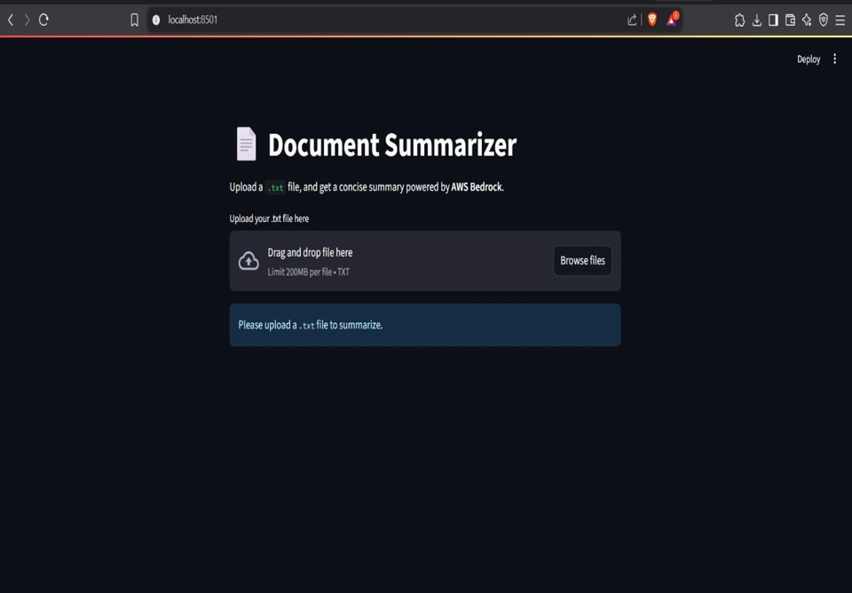
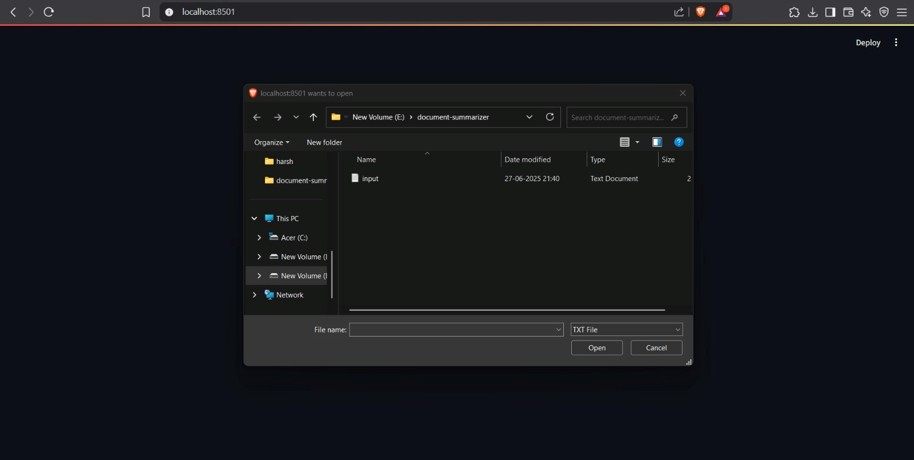
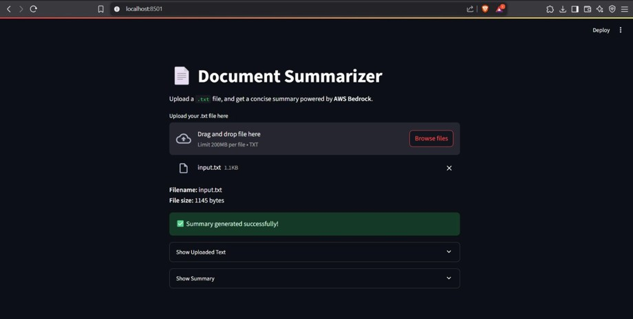
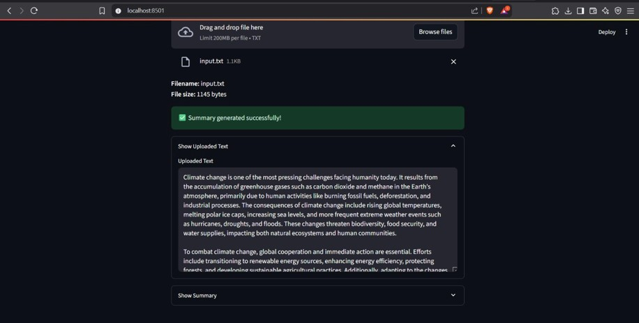
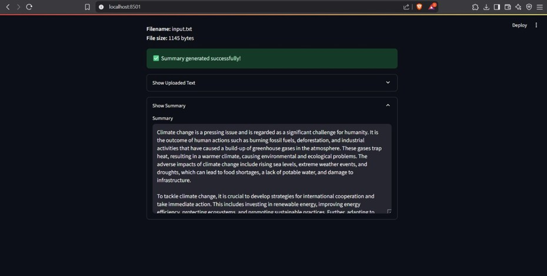

# 🔐 Secure Document Summarizer

## 📌 Project Overview

Secure Document Summarizer is a cloud-based web application that enables users to securely upload text documents and generate concise, meaningful summaries using AWS Bedrock.

The application is designed with a focus on cloud computing principles, secure file handling, and scalable document processing. It demonstrates how cloud services can be leveraged to perform intelligent text summarization efficiently without exposing sensitive user data.

This project highlights practical use of cloud-hosted AI services, making it suitable for academic evaluation, cloud computing coursework, and portfolio projects.

## 🎯 Objectives

* Securely upload documents (PDF / DOCX)
* Extract text from documents
* Generate summarized content
* Store and display results efficiently

## 🛠️ Technologies Used

* **Programming Language:** Python
* **Libraries:**

  * PyPDF2
  * python-docx
  * lxml
* **Concepts:**

  * File handling
  * Text extraction
  * Document summarization
  * Cloud-based workflow (conceptual)

## 📂 Project Structure

```
Secure-Document-Summarizer/
│── app.py               # Main application file
│── lambda_function.py   # Contains function 
│── requirements.txt     # Project dependencies
│── README.md            # Project documentation
│── outputs/             # Output screenshots

```

---

## ☁️ AWS Configuration (Required)

Before running this project, users must configure their **AWS credentials** in their AWS account to allow secure access to **AWS Bedrock**.

### 🔐 Prerequisites

* An active **AWS account**
* Access to **AWS Bedrock** enabled in your region
* An IAM user or role with permissions to use Bedrock

### 🧾 Steps to Configure AWS Credentials

1. Log in to the **AWS Management Console**.
2. Navigate to **IAM (Identity and Access Management)**.
3. Create a new IAM user or role with programmatic access.
4. Attach the required policies that allow access to **AWS Bedrock**.
5. Generate the **Access Key ID** and **Secret Access Key**.

### 💻 Configure Credentials Locally

Configure your credentials using the AWS CLI:

```bash
aws configure
```

Enter the following when prompted:

* AWS Access Key ID
* AWS Secret Access Key
* Default region name (where Bedrock is enabled)
* Default output format (json recommended)

Once configured, the application will securely authenticate with AWS services during runtime.

---

## ⚙️ Installation & Setup

### Step 1: Clone the Repository

```bash
git clone https://github.com/Harshini382/Secure-Document-Summarizer.git
cd Secure-Document-Summarizer
```

### Step 2: Install Dependencies

```bash
pip install -r requirements.txt
```

### Step 3: Run the Project

```bash
python app.py
```

---

## 📸 Output Screenshots

### 🏠 Application Home Page
Upload interface for submitting `.txt` files securely.


---

### 📂 File Selection
User selecting a text document for summarization.


---

### ✅ Successful Upload & Processing
Confirmation message after successful document upload and summary generation.


---

### 📄 Uploaded Text Preview
Displays the original uploaded document content.


---

### 📝 Generated Summary
Automatically generated concise summary using AWS Bedrock.


## 🔐 Security Features

* Controlled file upload
* Secure document handling
* No permanent storage of sensitive files (configurable)

---
## 🚀 Future Enhancements

* Add user authentication
* Improve summarization accuracy using NLP models

---
## 📚 Use Cases

* Academic document summarization
* Business report analysis
* Secure cloud-based document processing

---

## 👩‍💻 Author

**Harshini Gengaraj**

---

## 📜 License

This project is for educational purposes. Feel free to modify and use it as needed.
